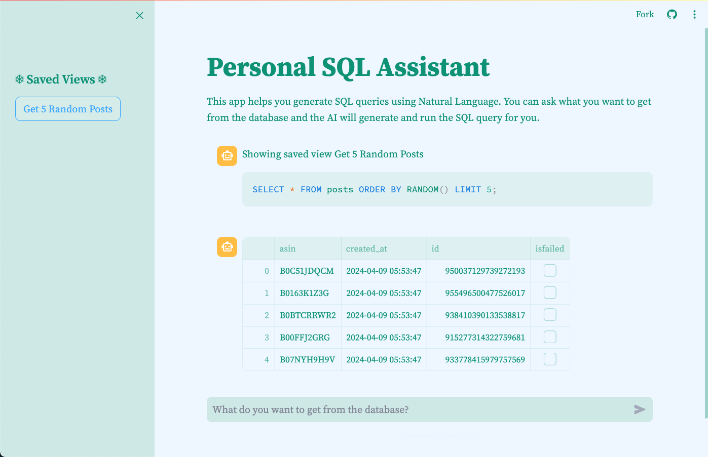

# Personal SQL Assistant

## Inspiration

The inspiration for **Personal SQL Assistant** came from the need to simplify data querying for individuals who may not have advanced SQL skills. I wanted to create a tool that leverages natural language processing to bridge the gap between users and complex database queries. The goal was to make data access and analysis more intuitive and accessible to everyone.

## Video Walkthrough

## What it does

**Personal SQL Assistant** allows users to interact with their databases using natural language. Users can input queries in plain English, and the assistant converts these into SQL statements, executes them, and returns the results. The app also provides an option to save frequently used queries as views, making it easy to run them again in the future.

## How we built it
-   **Database Interaction**: Using PostgreSQL to handle and execute SQL queries.
-   **NLP Integration**: Incorporating [Snowflake Arctic](https://www.snowflake.com/en/data-cloud/arctic/) via [Together.ai](https://www.together.ai/blog/snowflake-artic-llm) API to convert natural language inputs into SQL queries.
-   **Streamlit**: Building an interactive user interface with Streamlit, allowing users to input queries, view results, and save frequently used SQL statements.

## Challenges we ran into

-   **NLP Accuracy**: Ensuring the LLM model accurately interprets user queries and converts them into correct SQL statements was a significant challenge. By using few shot prompting coupled with a good system prompt and also ensuring schema of the database is passed in the system prompt prevented hallucinations on a good level.
-   **User Interface**: Designing an intuitive and responsive interface that caters to both novice and experienced users posed its own set of challenges. Balancing simplicity with functionality was key.
-   **State Management**: Keeping track of user sessions and saved views while ensuring data persistence across different app states required effective state management strategies.

## Accomplishments that we're proud of
-   Successfully integrating Snowflake Arctic to interpret the user's question and convert them into SQL statements.
-   Building an intuitive and user-friendly interface that simplifies the process of querying databases.
-   Implementing robust state management to maintain user session data, chat history, and saved views.

## What we learned

-   Effective few shot prompting
-   Using Streamlit to build and prototype interactive web applications very fast.
-   Importance of user-centric design in creating applications that cater to a wide range of users, from beginners to experts.

## What's next for Personal SQL Assistant
-   **Enhanced NLP Capabilities**: Further improve the accuracy and capabilities of the LLM by finetuning further on a specific schema and tables pertaining to the user.
-   **Advanced Visualizations**: Add visualization options and customization features for users to better analyze their data.
-   **User Authentication and Permissions**: Implement user authentication and permission controls to provide secure access to databases.
-   **Integration with More Databases**: Expand support to include more types of databases and data sources.